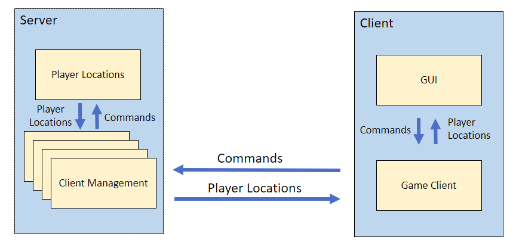
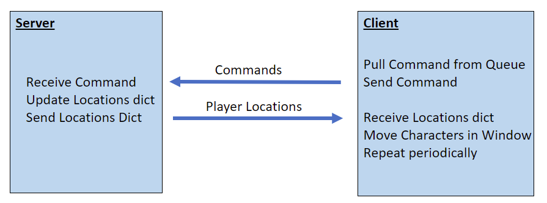

# rocket_palz
## Setup
1. Clone this repo
2. Create a virtual environment called venv in this repo. Should be python 3.
3. install PyQt5

## Starting the game 
1. Navigate to linux_scripts or windows_scripts depending on your OS.
2. run rocket_palz_server.sh or .bat to start the server. It will display the ip-address and port to connect your clients to. 
3. run rocket_palz_cient.sh or .bat to start the client
4. Enter the ip address and port from step 2 into the appropriate text box. 
5. Select the rocket pal you want to play as
6. Click the "Let's go" button and have fun

## Playing the game
Enjoy the space with your favorite rocket pals. Use the arrow keys to move around. Thats about there is to it!

# Architecture

Rocket Palz consists of a client and a server. The server stores a map of player locations, which it 
sends to all clients. The clients send commands to the server. These commands tell the server how to 
move the player the client is controlling. 
## Common
This module contains constants and enums that are relevant to both the server and the client. There are two 
major enums in the common module.
1. <b>Messages:</b> The commands that the clients can send to the server. These consist of all the arrow key directions. 
2. <b>PlayerEnum:</b> The player characters that players cand choose from. These are the rocket legends
Elon Musk, Tory Bruno, Jeff Bezos, and Peter Beck. 
## Server
The server consists of 3 major classes
0. <b>GameServer:</b> The main class of the rocket_palz_server module.Its job is to create a socket and listen
for clients trying to connect to that socket. When a client connects, it spins up a ClientManagementThread
to interact with the client. More details on the ClientManagementThread in the sections below.  
1. <b>PlayerLocations:</b> Maintains a dictionary of where each player character is. It receives commands
from the ClientManagementThreads, and uses them to update its dictionary of player locations. In addition, 
it provides its dictionary of player locations to each ClientManagementThread upon request. When a client
drops out, its character is removed from the location dictionary. 
2. <b>ClientManagementThread:</b> This is a threading.Thread class that manages each client thread. It receives
commnad messages from the client, and forwards them to the PlayerLocations object. In return, it sends
the dictionary of player locations back to the client so that the client knows where to render
its images.  
## Client
The client code is contained in rocket_palz.py. This module consists of 3 main classes. 
1. <b>ServerSelector:</b> This is the window that allows the user to select the server he/she wants to connect to
and what character he/she wants to play as. After the selection is made, this class hides itself and reveals
the ManWindow window. 
2. <b>MainWindow:</b> The window in which the game is played. This class does a few things. 
  * Holds a QLabel with an image of every possible player. These images are initially hidden, but
  are revealed if the character exists in the location dictionary sent by the server. The location of the images
  in the window are changed based on the locations provided by the location dictionary. 
  *  Listens for key press events. Direction commands are added to a command queue when the arrow keys
  are pressed. 
  * Spins up a QTimer. This allows MainWindow to periodically poll the server for the location of the characters.
  With these locations, it can move the appropriate QLabels around the window. 
3. <b>GameClient:</b> Manages communication with the server. When the QTimer in MainWindow rolls over, the GameClient
object checks the command queue for any messages. If there is a message, it sends the command to the server
in response, it will get the server's dictionary of character locations. If there is no message, the 
object will send a none message, an will still get back the character location dictionary. 
## Messages

### Client to Server
The client sends the server a string that represents the direction the player wants to move his/her character.
These commands are defined in common.Messages. They include:
1. none: Do not move the character
2. up: Move the character up
3. down: Move the character down
4. left: Move the character left
5. right: Move the character right

### Server to Client
When the server receives a command from the client, it sends back a dictionary telling the client where each
character should be. The dictionary is converted to a JSON string before sending. The format of this 
dictionary is:
* key: string, the name of the character
* value: coordinate dictionary
  * x: the x location the character is at
  * y: the y location the character is at

The dictionary only contains characters to be rendered. If a player disconnects, their character is removed from
the dictionary. 